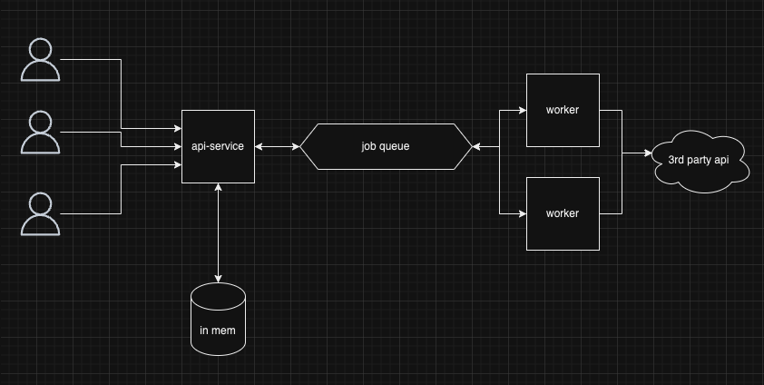

# Weather Project

## How to run
```bash
docker compose up
```
## Architecture


## Technologies
- Framework: 
    - FastAPI
    - Reason: 
        - Its fast & pretty easy to set up (compared to its counter parts)
        - I wanted to check it out
        - Nice way to add validations using pydent
- Package:
    - Docker compose
    - Reason: Worked with it in the past, pretty common & good for this case
- Pub/Sub:
   - Redis queue: helps abit with scale, sepration of concers
- Caching:
   - In memory caching: easy to implement, pretty good use case

## "Tricks"
- Added cachings on the endpoints of the `api-service`
   - Small cache, could help, really easy to implement
- Added "pre-fetch" of popular cities
   - One would assume that these would be triggered more ofter compared to lesser known ones
- A bit of multi threads + added another `worker` service just to show the idea

## Stuff that could & should be improved:
- Create our own DB. We can & should save some of this stuff on disk & not fetch it from the third party. The results of the top 100 cities, maybe names of all the cities in the world which could help with validations etc...
- The `Worker` code should be separated & simplified
- Use bigdata machines & Technologies (spark, pandas & such)
- Better error handling
- Tests

and much much more...

## Disclaimers:
- I used Chatgpt to help in some of the stuff
- I had to "brush up" on some of these things
- Regaring the requests:
    - Scale: added the Pub/Sub, worker machines, a bit of caching, asyns.
    - Error handling: Using the pydent objects & a bit of try catches & logs
- This took me more than 3 hours. Maybe 4/4.5, i didn't look at the watch

